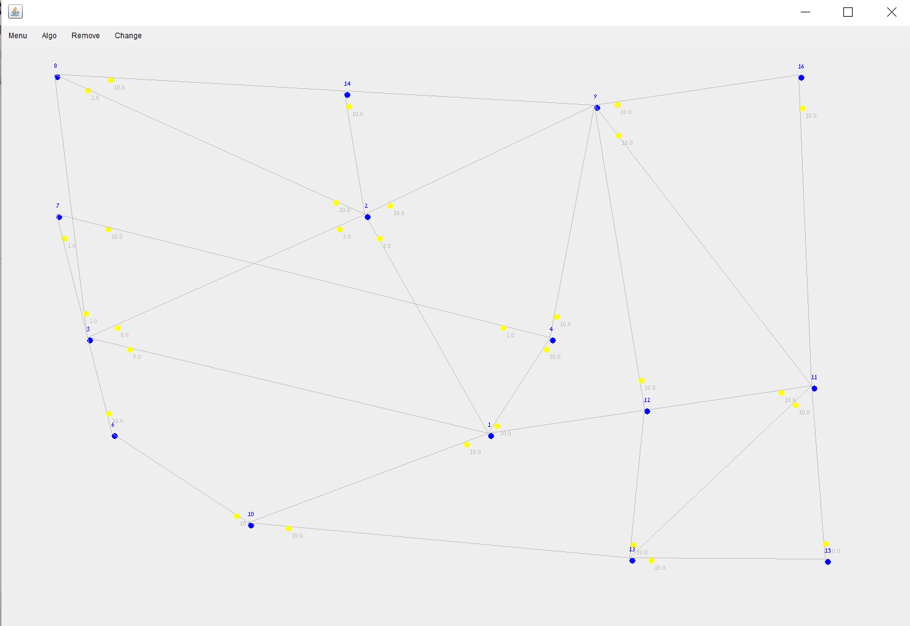

# OPP-Ex2

Main purpose of the project is to:  
* Create directed weighted graph
* Display the graph on graphic user interface 
* Run algorithms on the graph.
* create a data structure that will save\load graph 

 **Class Node contains:**

1) key    
2) location    
3) info    
4) tag  
5) weight  

**Class Edge contains:**  

1) src  
2) dst  
3) tag  
4) weight  
5) info  

**Class DGraph functions:** 

1) ***getNode(int key)***    
2) ***getEdge(int src, int dest)***    
3) ***addNode(node_data n)***    
4) ***connect(int src, int dest, double w)***    
5) ***Collection<node_data> getV()***     
6) ***Collection<edge_data> getE(int node_id)***  
7) ***node_data removeNode(int key)***    
8) ***edge_data removeEdge(int src, int dest)***    
9) ***nodeSize()***    
10) ***edgeSize()***     
11) ***getMC()***    

**Class Graph_Algo functions:**

1) ***init(graph g)***  --> Init this set of algorithms on the parameter - graph.  
2) ***graph copy()***  --> Compute a deep copy of this graph.  
3) ***init(String file_name)***  --> Init a graph from file.  
4) ***save(String file_name)***  --> Saves the graph to a file.  
5) ***isConnected()***  --> eturns true if graph is strongly connected.  
6) ***shortestPathDist(int src, int dest)***  --> returns the length of the shortest path between src to dest.  
7) ***List<node_data> shortestPath(int src, int dest)***  --> returns the the shortest path between src to dest - as an ordered List of nodes.  
8) ***List<node_data> TSP(List targets)***  --> computes a relatively short path which visit each node in the targets List.  

**How to use GUI** 

* Blue dots indicate a node(vetrix)   
*  line indicate an edge  
* The yellow dots indicate the direction of the edge.  
  for example: If there is an edge between nodes 1 and 2 and the point is near to node number 1 it means that the edge is from 2 to 1.  
* The number next to each yellow dot is the weight of this edge 
* add node:  just click one time on the window to place new node   
* add edge: just click on the window to place new node and grab your mouse to the point you want the dest key.  
* you can also connect between Existing nodes.  
* The automatic weight that each edge you create in the graph will be 10(can be change with the Change button)  

**Menu bar options:**

***Menu***  
Save:  you can save the graph as file  
Load: load the graph from the file that you saved  
***Algorithms***  
Shortest Path Distance: returns the length of the shortest path between src to dest  
Shortest Path: returns the the shortest path between src to dest - as an ordered List of nodes    
is connected: check if the graph have strong conncetion
TSP: computes a relatively short path which visit each node in the targets List.

***Remove***   
Remove node: insert key on node to remove  
* Remove edge : insert src key and dest key to remove edge  

***Change***   
* You can change the weight of the edge by insert src key and dest key and weight 

